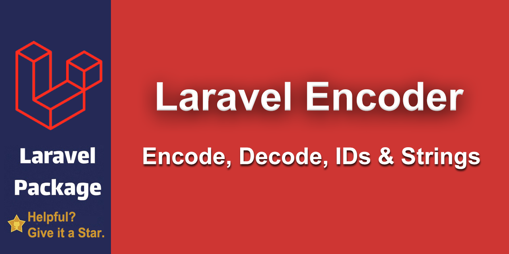

<div align="center">

# Laravel Encoder Package




</div>

The Laravel Encoder package provides a robust and secure way to `encode` and `decode` **IDs** & **Strings** using customizable Base encoding mechanisms (Base62). With support for variable-length encoding, mappers for added security, and seamless integration with Laravel, this package is ideal for obfuscating sensitive data or creating URL-safe identifiers.
### Why I Created This Package
In one of my Laravel projects, I needed a way to `encode` & `decode` some strings. Initially, I tried using Laravel's built-in `encrypt` and `decrypt` functions, but they returned very long strings, which were not ideal for my use case.
Next, I turned to Base64 encoding, but I still needed to make it URL-safe, which added complexity. After looking around, I realized that there wasn't a straightforward package that supported encoding both **IDs** and **strings** while providing a customizable approach and URL-safe encoding.
So, I decided to create this package. It started as a solution for my Laravel project, but I quickly realized its usefulness beyond that and made it a standalone package that can be used in any PHP project.
With this package, I aimed to provide a simple, secure, and customizable `encoding/decoding` mechanism with support for Base62 encoding (which is URL-safe), and the ability to easily add more bases like Base58, Base64, or even your own custom encoding schemes.

> **Warning**: This package is designed for encoding and obfuscation, not for encryption. It does not provide strong cryptographic security. Use it for non-sensitive data or as a lightweight obfuscation method.
### Features
- **Base Encoding**: Supports customizable bases, including Base62 and others.
- **Variable-Length Encoding**: Allows encoding with custom lengths for obfuscation.
- **Mapper-Based Obfuscation**: Adds an extra layer of security by using configurable prime numbers and mappers.
- **Customizable Configuration**: Publish the configuration file to override default mappers.
- **Exception Handling**: Provides detailed exceptions for invalid inputs.
- **Laravel Integration**: Works seamlessly with Laravel’s service container and configuration system.
- **Security**: Protects sensitive IDs by ensuring encoded values are not easily reversible without the correct configuration.

### Requirements
- PHP 8.1 or higher
- Laravel 10 or higher (optional, for Laravel integration)
- `bcmath` PHP extension enabled
- `mbstring` PHP extension enabled for encoding and decoding multi-byte strings (Persian, Arabic, etc.)

### Installation
**Step 1: Install via Composer**
```bash
composer require nassiry/laravel-encoder
```
### Laravel Integration
This package integrates seamlessly with Laravel, making it easy to encode or decode IDs and strings using the service container, dependency injection, or facades.
#### Using the Service Container

```php
$encoder = app('Encoder');

// Encoding and Decoding IDs
$encodedId = $encoder->encodeId(12345);
$decodedId = $encoder->decodeId($encodedId);

// Encoding and Decoding Strings
$encodedString = $encoder->encodeString('Hello World');
$decodedString = $encoder->decodeString($encodedString);
```
#### Using Dependency Injection
For better maintainability and testability, inject the encoder into your controllers or services:
```php
use Nassiry\Encoder\Encoder;

class MyController extends Controller
{
    public function __construct(protected Encoder $encoder)
    {
        // Your other codes
    }

    public function encodeData()
    {
        $encoded = $this->encoder->encodeString('my data');
        return response()->json(['encoded' => $encoded]);
    }
}
```
#### Using the Facade
The package provides a facade for quick access to encoder methods:
```php
use Nassiry\Encoder\Facades\Encoder;

// Encoding and Decoding IDs
$encodedId = Encoder::encodeId(12345);
$decodedId = Encoder::decodeId($encodedId);

// Encoding and Decoding Strings
$encodedString = Encoder::encodeString('Hello World');
$decodedString = Encoder::decodeString($encodedString);
```

### Standalone Usage
To use the package in a non-Laravel PHP project, follow these steps:
1. #### Usage Example
```php
require __DIR__ . '/vendor/autoload.php';

use Nassiry\Encoder\Encoder;

// Create an Encoder instance
$encoder = new Encoder();

// Encoding an ID
$encodedId = $encoder->encodeId(12345);
echo "Encoded ID: $encodedId\n"; // eqwb

// Decoding an ID
$decodedId = $encoder->decodeId($encodedId);
echo "Decoded ID: $decodedId\n"; // 12345

// Encoding an ID with length
$encodedId = $encoder->encodeId(12345, 8); 
echo "Encoded ID: $encodedId\n"; // d29Buhe7

// Decoding an ID
$decodedId = $encoder->decodeId($encodedId);
echo "Decoded ID: $decodedId\n"; // 12345

// Encoding a String
$encodedString = $encoder->encodeString('Hello World');
echo "Encoded String: $encodedString\n"; // 73XpUgyMwkGr29M

// Decoding a String
$decodedString = $encoder->decodeString($encodedString);
echo "Decoded String: $decodedString\n"; // Hello World
```
2. #### Custom Configuration
When using a custom configuration, ensure that the `$length` parameter in the `encodeId` function is **an index within the configuration array**. It must be smaller than the last index of the configuration array.
```php
$config = [
     1 => '1',
    41 => '59',
    2377 => '1677',
    147299 => '187507',
    9132313 => '5952585',
];

$encoder = new Encoder('base62', $config);

// $length refers to the index (0-based), not the key
$customEncodedId = $encoder->encodeId(12345, 3);

echo "Custom Encoded ID: $customEncodedId\n"; // qVX
```
#### Important Notes:
1. The `$length` parameter represents the **index** in the configuration array, **not the key value**.
2. It must always be smaller than the highest index of the configuration array.
3. For example, in the above `$config`, the valid values for `$length` are `0`, `1`, `2`, `3`, or `4` (total of 5 elements, indices `0–4`).
### Encoder Configuration File
**Note:** This configuration file is applicable only when using the package with a **Laravel application**.
For standalone usage, you need to provide configuration directly while initializing the `Encoder` class.
This file allows you to set up the default base encoder and customize its behavior within Laravel.
By default, the package uses the `base62` encoder, but you can define additional configurations
for Base62 or other custom Base classes that you may add via the Factory.
### Default Base62 Configuration
If you are using the default Base62 implementation, you can override its default mappers
by specifying custom mappings in the `config` array below. These mappers are used to obfuscate
the encoding process by applying prime numbers for variable-length encoding.
Example for overriding Base62 mappers:
```php
'config' => [
    1 => '1',
    5 => '41',
    6 => '2377',
    7 => '147299',
    8 => '9132313',
],
```
### Usage in Laravel
To publish this configuration file, run the following command:
```bash
php artisan vendor:publish --provider="Nassiry\Encoder\EncoderServiceProvider"
```
After publishing, you can modify the configuration to suit your application's needs.
### Custom Bases: Add Your Own Encoding Scheme
  - If you are implementing your own Base class (Base58 or Base64):
  - Implement the `BaseEncoderInterface` in your class.
  - Add your custom base to the `BaseFactory`.
  -  Use this `config` array to define any specific configuration required for your custom base.
```php
use Nassiry\Encoder\Bases\BaseEncoderInterface;

class Base58 implements BaseEncoderInterface
{
    public function encodeId(int|string $id, int $length): string
    {
        // Implement encoding logic for Base58
    }

    public function decodeId(string $hashed): string
    {
        // Implement decoding logic for Base58
    }
    
    public function encodeString(string $string): string;
    {
        // Implement encoding logic for Base58
    }
    
    public function decodeString(string $encoded): string;
    {
        // Implement decoding logic for Base58
    }
}
```
### Register the new base in the `BaseFactory` - `create` method:
```php
return match (strtolower($base)) {
    'base62' => new Base62($config),
    'base58' => new Base58($config),  // Register Base58 here
    default => throw EncoderException::unsupportedBase($base),
};
```
### Use your custom base like this:
```php
use Nassiry\Encoder\Encoder;

$encoder = new Encoder('base58');

$encodedId = $encoder->encodeId(12345);
echo "Base58 Encoded ID: $encodedId\n";

$decodedId = $encoder->decodeId($encodedId);
echo "Decoded ID: $decodedId\n";
```
### Handling Exceptions
The package throws meaningful exceptions for invalid input and other runtime issues, making it easier to debug and handle errors gracefully.
The `EncoderException` class extends PHP's `RuntimeException` and provides static methods for creating specific exceptions.
#### Common Exceptions
- **Invalid ID**: Thrown when an ID is not a valid non-negative integer.
- **Invalid Length**: Thrown when length is not a valid non-negative integer.
- **Empty Input**: Thrown when the input string is empty.
- **Invalid Base String**: Thrown when a string contains invalid characters for the base.
- **Invalid Base**: Thrown when a base (Base58 or Base64) is not registered in the Factory.
- **Invalid Method Call**: Thrown when an undefined method is called on a base encoder.
- **Invalid Class**: Thrown when a custom base class does not implement the required `BaseEncoderInterface`.
```php
EncoderException::invalidId(); 
// Message: "The ID must be a non-negative integer."

EncoderException::invalidLength($length);
// Message: "The length must be greater than zero. Given: 0"

EncoderException::emptyInput(); 
// Message: "Input string cannot be empty."

EncoderException::invalidBaseString(string $char, string $base); 
// Message: "Invalid character '!' in 'base62' string."

EncoderException::invalidBase(string $base); 
// Message: "Encoder base 'base64' is not supported."

EncoderException::invalidMethod(string $method); 
// Message: "Method 'fooBar' does not exist on the base encoder."

EncoderException::invalidClass(string $className); 
// Message: "Class 'MyBaseEncoder' must implement BaseEncoderInterface."
```
#### Example: Catching Exceptions
You can wrap your encoding/decoding logic in a `try-catch` block to handle exceptions gracefully:
```php
use Nassiry\Encoder\Exceptions\EncoderException;

try {
    $encoded = $encoder->encodeId(-1); // Invalid ID
} catch (EncoderException $e) {
    echo "Error: " . $e->getMessage();
}
```
### Testing
To ensure the package functions as expected and meets all requirements, you can run the included tests. Follow the steps below to execute the test suite:
#### Prerequisites
1. Ensure you have all dependencies installed by running:
```bash
composer install
```
2. Verify that the required PHP extensions (`bcmath` and `mbstring`) are enabled.
#### Running Tests
Execute the following command to run the test suite:
```bash
composer test
```
#### Test Coverage
The package comes with extensive test coverage for encoding and decoding methods, exception handling, and configuration. This ensures robust behavior across various use cases.
#### Contributing to Tests
If you encounter a bug or add a new feature, consider writing or updating the tests. Use the following guidelines:
1. Add your test cases to the appropriate files in the `tests` directory.
2. Follow the `PSR-12` coding standards for consistency.
3. Run `composer test` again to verify that all tests pass before submitting a pull request.
### Why Base62?
[Why Base62?](base62.md)
### Conclusion: Why Choose This Package?
[Conclusion](conclusion.md)
### Contributing
Feel free to submit issues or pull requests to improve the package. Contributions are welcome!

### License
This package is open-source software licensed under the [MIT license](LICENSE).
